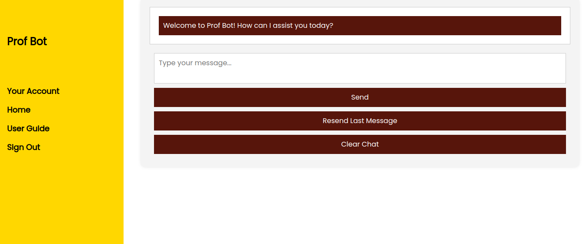

# ProfBot
Chatbot web application group project for the Software Engineering I Fall 2023 Course at Rowan University with Professor Jeffrey Pierantozzi

## Functionality
A chatbot web application for Rowan University students and others interested in the University. Supports over 25 questions. Provides following features and information:

- Multifeatured schedule creator for upcoming Spring semester
- Courses offered throughout the entire school year
- Sections offered in upcoming Spring semester
- Current events happening during the current Fall semester
- Personalized experience through user account

## Tech Stack
- Flask Backend
- Rasa Chatbot Framework
- SQLite Database
- Vanilla HTML/CSS/JavaScript
- Various Python Libraries for schedule creation, scraping data, etc.

## Instructions
The application was originally hosted on AWS.

Instructions for running locally coming soon....

